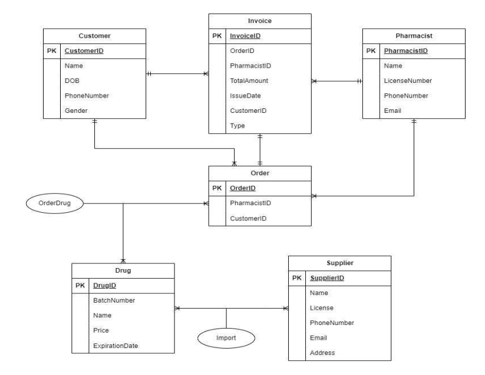

# Pharmacy Database System

## Overview
This project presents a database design for a pharmacy management system, focusing on how data is structured and used to support basic business operations.

The system manages core entities such as customers, orders, invoices, and drug inventory.

---
## Database Design
Main entities in the system include:
- Customer  
- Drug  
- Order  
- Invoice  

See ERD diagram below:

---

## My Contributions
- Contributed to ERD design and database structure  
- Wrote SQL queries for selected business cases  
- Performed basic data insertion and handling  

Details of these contributions are included in the project report.

---

## Technologies
- SQL (SQL Server)

---

## Note
This project was developed as a group assignment.
